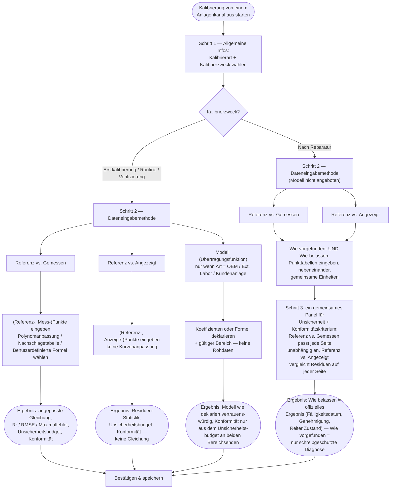

Kalibrierung ist der Kern dessen, was Open Gauge leistet: die Messwerte eines Sensors gegen eine
vertrauenswürdige Referenz vergleichen, eine Korrekturkurve anpassen, die Messunsicherheit bewerten
und eine Bestanden/Nicht-bestanden-Aussage treffen — alles nach
[JCGM 100:2008 (GUM)](../reference/standards-glossary.mdx) und
[ISO/IEC 17025:2017](../reference/standards-glossary.mdx).

## Zwei Backend-Berührungspunkte

Ein Kalibrierereignis umfasst zwei API-Aufrufe:

1. **`POST /calibrations/analyze`** — flüchtig. Nimmt rohe (Referenz-, Mess-)Punktpaare sowie
   Anpassungs-/Unsicherheitsparameter entgegen, führt die vollständige Analyse durch und gibt das
   Ergebnis zurück. **Es wird nichts gespeichert.** Der Kalibrier-Assistent ruft dies bei jeder
   Eingabeänderung auf (entprellt), um beim Eingeben von Daten Live-Feedback zu geben.
2. **`POST /calibrations`** — atomare Erstellung. Nimmt das bereits berechnete Ergebnis entgegen
   (der Assistent leitet weiter, was `/analyze` zurückgegeben hat) sowie Metadaten und schreibt eine
   `calibrations`-Zeile und ihre Datenpunktzeilen in einer einzigen Transaktion. Eine
   Zertifikats-PDF wird nach bestem Bemühen in derselben Anfrage generiert.

Diese Aufteilung existiert, damit Sie frei verschiedene Polynomgrade, Verteilungen und
Entscheidungsregeln erkunden können, bevor Sie sich festlegen — der teure, persistierte Schritt
geschieht nur einmal, beim Speichern.

## Der Kalibrier-Assistent

Starten Sie eine Kalibrierung vom Kanal einer Anlage aus. Der Assistent hat drei Schritte:

1. **Allgemeine Informationen** — Kalibrierart und -zweck (siehe unten), Kalibrierdatum,
   **Erfasst von** (eine Dropdown-Liste der Organisationsmitglieder der Anlage, standardmäßig Sie
   selbst), ein optionaler Prüfer **Geprüft von**, Kalibrierintervall, Umgebungsbedingungen und
   Notizen. Je nach gewählter Art/gewähltem Zweck erscheinen zusätzliche Felder — siehe unten.
2. **Eingabedaten** — beginnt mit einem Methoden-Selektor: **Referenz vs. Gemessen** (Standard —
   (Referenz-, Mess-)Punktpaare gegenüber dem rohen Ausgangssignal des Kanals, an eine Kurve
   angepasst), **Referenz vs. Angezeigt** (Referenz gegenüber einem bereits umgerechneten
   physikalischen Messwert, ohne Kurvenanpassung), oder **Modell (Übertragungsfunktion)** (ein vom
   Labor angegebenes Modell, ganz ohne Rohdatenpunkte — nicht verfügbar, wenn der Kalibrierzweck
   Nach Reparatur ist). Siehe
   [Alternative Dateneingabemodi für Kalibrierungen](./coefficients-only.mdx) für die vollständige
   Aufschlüsselung, einschließlich wie Nach Reparatur Referenz vs. Gemessen/Angezeigt automatisch
   in Wie-vorgefunden-/Wie-belassen-Daten aufteilt. Siehe
   [Kurvenanpassung](./curve-fitting.mdx) dazu, was Open Gauge mit den Rohdaten macht.
3. **Analyse/Überprüfung** — die live berechnete Anpassung, das Unsicherheitsbudget und die
   Konformitätsaussage. Siehe [Das Unsicherheitsbudget](./uncertainty-budget.mdx) und
   [Entscheidungsregeln](./decision-rules.mdx).

Das Speichern wird nie durch ein nicht bestandenes (nicht konformes) Ergebnis blockiert — eine
nicht bestandene Kalibrierung ist weiterhin ein wichtiger, echter Datensatz. Entspricht das Ergebnis
nicht der Spezifikation des Kanals, zeigt die Speicherbestätigung eine explizite Warnung mit Nennung
der Spezifikation und Entscheidungsregel, und die Speichern-Schaltfläche wird zu
**"Trotzdem speichern"** umbenannt.

### Einen Arbeitsablauf wählen [#choosing-a-workflow]

Zwei Entscheidungen bestimmen alles darüber, wie der Rest des Assistenten aussieht und was der
gespeicherte Datensatz kann: der **Kalibrierzweck** in Schritt 1 und die **Dateneingabemethode**
in Schritt 2. Jedes andere Feld in Schritt 1 (Art, Daten, Labor, Notizen) wirkt sich nur darauf
aus, *wem* die Kalibrierung zugeschrieben wird und *woher ihr Zertifikat stammt* — es ändert nie
die Form von Schritt 2 oder Schritt 3, außer dass die **Kalibrierart** bestimmt, ob **Modell
(Übertragungsfunktion)** überhaupt angeboten wird (nur für OEM, Externes akkreditiertes Labor und
Kundenanlage — siehe [Kalibrierart](#calibration-type) unten).

Alle Pfade laufen beim Speichern im selben [Genehmigungsablauf](#approval-workflow) und derselben
[Versionsnummerierung](#version-numbers) zusammen — ein nicht bestandenes oder rein diagnostisches
Ergebnis wird genauso gespeichert wie ein konformes, und jeder Pfad erzeugt einen normalen
Kalibrierdatensatz mit Zertifikat. Was sich zwischen den Pfaden unterscheidet, ist nur, *was
berechnet werden konnte*: Referenz vs. Angezeigt und Modell erzeugen nie eine angepasste
Kurvengleichung (es gibt keine bekannte Übertragungsfunktion, die angepasst werden könnte), und
die Wie-vorgefunden-Seite von Nach Reparatur fließt nie in das Fälligkeitsdatum oder den Reiter
Zustand ein, unabhängig davon, von welcher Basismethode aus gestartet wurde. Siehe
[Alternative Dateneingabemodi für Kalibrierungen](./coefficients-only.mdx) für die vollständige
feldweise Aufschlüsselung jedes Zweigs oben.

## Kalibrierart [#calibration-type]

Die **Kalibrierart** beschreibt, *wer die Kalibrierung durchgeführt hat*, und bestimmt, worauf sich
das Feld **Kalibrierlabor** auflöst:

- **OEM** — durchgeführt vom Hersteller des Sensors. Das Kalibrierlabor ist eine schreibgeschützte
  Momentaufnahme des Herstellers der Anlage zum Zeitpunkt des Speicherns (nicht vom Benutzer
  bearbeitbar). Ein Upload des **Kalibrierzertifikats** ist verfügbar (nur PDF).
- **Externes akkreditiertes Labor** — durchgeführt von einem externen, akkreditierten Labor. Das
  Kalibrierlabor ist eine Dropdown-Liste Ihrer
  [externen Organisationen](../organizations/index.mdx#internal-vs-external-organizations), die als
  Anbieter gekennzeichnet sind. Ein Upload des **Kalibrierzertifikats** ist verfügbar (nur PDF).
- **Internes Labor (im eigenen Haus)** — durchgeführt von Ihrer eigenen Organisation, gegen eine
  Ihrer eigenen Anlagen, die als [Referenznormal](../sensors/adding-a-sensor.mdx#calibration-role)
  gekennzeichnet ist. Das Kalibrierlabor ist eine Dropdown-Liste der Standorte Ihrer Organisation,
  die als Kalibrierlabore gekennzeichnet sind. Wenn Sie eine Referenz-Anlage auswählen, ruft Open
  Gauge automatisch die erweiterte Unsicherheit der letzten Kalibrierung dieser Anlage ab und
  rechnet sie als `reference_standard`-Beitrag in das Unsicherheitsbudget dieser Kalibrierung ein —
  siehe [Das Unsicherheitsbudget](./uncertainty-budget.mdx#contributions). Kein Zertifikats-Upload
  — das systemgenerierte Zertifikat ist das einzige, da es sich um Ihre eigene Messung handelt.
- **Kundenanlage** — die Anlage gehört einem Kunden und wird in dessen Auftrag kalibriert. Das
  Kalibrierlabor ist eine Dropdown-Liste Ihrer externen Organisationen, die als Kunden
  gekennzeichnet sind. Kein Zertifikats-Upload.

Für OEM, Externes akkreditiertes Labor und Kundenanlage kann die Rohdateneingabe vollständig
übersprungen werden, indem in Schritt 2 die Eingabemethode **Modell (Übertragungsfunktion)**
gewählt wird, wenn das Zertifikat das Kalibriermodell direkt angibt — siehe
[Alternative Dateneingabemodi für Kalibrierungen](./coefficients-only.mdx).

### Hochgeladene Zertifikate

Wenn ein PDF-Zertifikat hochgeladen wird (nur OEM / Externes akkreditiertes Labor), überprüft Open
Gauge, dass es sich tatsächlich um ein PDF handelt (Content-Type und Dateisignatur), bevor es
akzeptiert wird. Nach dem Hochladen hat es überall dort, wo das Zertifikat einer Kalibrierung
heruntergeladen wird, **Vorrang** vor dem systemgenerierten Zertifikat — das systemgenerierte wird
weiterhin erzeugt und gespeichert, aber solange das hochgeladene existiert, wird stattdessen dieses
ausgeliefert. Das hochgeladene Zertifikat erscheint außerdem im Reiter **Dateien** der Anlage,
gekennzeichnet mit einem Abzeichen "Kalibrierzertifikat"; es kann von dort heruntergeladen, aber
nicht gelöscht werden — die einzige Möglichkeit, es zurückzuziehen, besteht darin, die Kalibrierung
selbst zu entwerten, im Einklang damit, dass die Kalibrierhistorie nie nachträglich bearbeitet wird.

## Kalibrierzweck

Der **Kalibrierzweck** hält fest, *warum* die Kalibrierung durchgeführt wurde:

- **Erstkalibrierung** — die erste Kalibrierung der Anlage/des Kanals. Standardmäßig ausgewählt,
  wenn noch keine vorherige Kalibrierung für den Kanal existiert; Sie können sie bei Bedarf ändern.
- **Routine** — eine periodische Rekalibrierung. Der Standard, sobald mindestens eine vorherige
  Kalibrierung existiert.
- **Nach Reparatur** — im Anschluss an eine Reparatur. Zeigt ein **Reparaturdatum**
  (Datumsauswahl) und eine **Reparaturbeschreibung** (bis zu 500 Zeichen). Teilt außerdem die
  Referenz-vs.-Gemessen/Angezeigt-Eingabe aus Schritt 2 automatisch in getrennte
  Wie-vorgefunden-/Wie-belassen-Daten auf — siehe
  [Alternative Dateneingabemodi für Kalibrierungen](./coefficients-only.mdx#after-repair-as-foundas-left-data).
  Siehe unten, wie sich dies auf den Reiter Zustand auswirkt.
- **Verifizierung** — eine Kalibrierung, die durchgeführt wird, um die fortlaufende Konformität zu
  überprüfen, ohne notwendigerweise die Intervalluhr zurückzusetzen, wie es eine routinemäßige
  Rekalibrierung tun würde.

### Driftvergleich vor/nach Reparatur

Das Erfassen einer **Nach-Reparatur**-Kalibrierung mit einem Reparaturdatum markiert eine Grenze in
der Kalibrierhistorie des Kanals. Der Reiter Zustand erhält ein Zeitraum-Dropdown —
**"Vor Reparatur `{Datum}`"** für jede erfasste Reparatur, plus **"Aktuell"** (der Zeitraum seit der
letzten Reparatur, standardmäßig ausgewählt) — mit dem Sie Drift-, Stabilitäts- und
Vorhersagemetriken über Reparaturereignisse hinweg vergleichen können, statt immer auf die
vollständige ununterbrochene Historie zu blicken, die sonst das Verhalten vor und nach der
Reparatur zu einem einzigen irreführenden Trend vermischen würde.

## Wo Ergebnisse landen

Historische Kalibrierungen sind auf der Detailseite der Anlage einsehbar — jede vergangene
Kalibrierung für jeden Kanal, neueste zuerst, jeweils mit vollständiger Analyse, Unsicherheitsbudget
und Zertifikat. Nichts wird jemals nachträglich bearbeitet; eine erneute Kalibrierung ist eine neue
Zeile, keine Korrektur einer alten.

## Versionsnummern

Die **Version** jeder Kalibrierung (`v1`, `v2`, …) ist ein stets steigender, pro Anlage (bzw.
Anlagenkanal) eindeutiger Zähler — die nächste Ganzzahl, beginnend bei 1, die beim Speichern des
Datensatzes vergeben wird. Sie basiert **nicht** auf `calibration_date`: Das Nacherfassen einer
Kalibrierung, deren Eingabe Sie früher vergessen haben, erhält weiterhin die nächste verfügbare
Nummer, nicht eine Nummer, die ihre chronologische Einordnung widerspiegelt. Eine einmal vergebene
Version ist dauerhaft — sie wird nie wiederverwendet (auch nicht die einer entwerteten Kalibrierung,
siehe unten) und nie neu nummeriert.

## Genehmigungsworkflow

Jede Kalibrierung hat einen **Status**: **gültig** (verwendet für die Kalibrierung des Kanals,
Fälligkeitsdatum-Berechnungen und die Driftanalyse), **Genehmigung ausstehend**, **abgelehnt**, oder
**entwertet**. Nur eine **gültige** Kalibrierung wird verwendet — die anderen drei sind alle von
Fälligkeitsdatum-/Statusberechnungen und der Drift-Analyse im Reiter Zustand ausgeschlossen, ebenso
wie es bei einer entwerteten schon immer der Fall war.

Die Benennung eines Prüfers unter **Geprüft von** in Schritt 1 versetzt die neue Kalibrierung in den
Status **Genehmigung ausstehend** statt gültig. Der Prüfer erhält eine Benachrichtigung (in der App
und per E-Mail, falls konfiguriert) und kann von derselben Zeile im Reiter Kalibrierung aus:

- Sie **genehmigen** — die Kalibrierung wird **gültig**, und die Person, die sie erfasst hat, wird
  benachrichtigt.
- Sie **ablehnen**, mit einem optionalen Grund — die Kalibrierung wird **abgelehnt**, und die
  erfassende Person wird benachrichtigt. Eine abgelehnte Kalibrierung ist endgültig: Ihre Korrektur
  bedeutet, eine neue Kalibrierung zu erfassen, nicht die alte zu bearbeiten, im Einklang damit,
  dass die Kalibrierhistorie nie nachträglich geändert wird.

Nur der zugewiesene Prüfer oder ein `admin`/`superadmin` als Override können eine gegebene
Kalibrierung genehmigen oder ablehnen. Wird **Geprüft von** nicht gesetzt, wird der Workflow
vollständig übersprungen — die Kalibrierung wird sofort als **gültig** angelegt, genau wie vor
Einführung dieser Funktion.

Der Schalter **Gültige Kalibrierungen anzeigen** im Reiter Kalibrierung (jede Rolle außer Viewer)
steuert, ob Kalibrierungen mit ausstehender Genehmigung, abgelehnte und entwertete Kalibrierungen
überhaupt angezeigt werden — standardmäßig aus, sodass die Historie auf das fokussiert bleibt, was
tatsächlich in Kraft ist.

## Eine Kalibrierung entwerten

Die Kalibrierhistorie wird nie zerstört — es gibt keine Löschen-Schaltfläche, nur **Entwerten**,
beschränkt auf `admin`/`superadmin`. Das Entwerten ist von jedem Status aus erreichbar (gültig,
Genehmigung ausstehend oder abgelehnt) als jederzeit verfügbarer Override. Das Entwerten eines
Eintrags (über das Papierkorb-Symbol in seiner Zeile im Reiter Kalibrierung):

- Markiert ihn als ungültig und hält optional fest, warum.
- Blendet ihn standardmäßig aus der Liste der Kalibrierhistorie und der Anlagenübersicht aus (ein
  Admin kann **Gültige Kalibrierungen anzeigen** aktivieren, um ihn zusammen mit etwaigen
  ausstehenden oder abgelehnten Einträgen wieder zu sehen).
- Schließt ihn von Fälligkeitsdatum-/Statusberechnungen aus, sodass ein ungültiger Eintrag eine
  Anlage nicht als kalibriert erscheinen lassen kann, obwohl sie es nicht ist.
- Schließt ihn von der Drift-/Stabilitätsanalyse im Reiter Zustand und dem Kurvenvergleichs-Dropdown aus.

Der Datensatz, seine Datenpunkte und sein Zertifikat bleiben allesamt unverändert erhalten —
das Entwerten schaltet nur ein Kennzeichen um. Ein Admin kann eine entwertete Kalibrierung jederzeit
aus derselben Zeile **wiederherstellen**, was sie stets wieder auf **gültig** setzt (es wird nicht
versucht, eine zuvor abgelehnte Kalibrierung zurück auf "abgelehnt" oder "Genehmigung ausstehend" zu
setzen). Siehe [Kalibrierungen](/docs/api/calibrations) in der API-Referenz für die genauen Payloads
von `DELETE /calibrations/{id}`, `POST /calibrations/{id}/restore`,
`POST /calibrations/{id}/approve` und `POST /calibrations/{id}/reject`.

Ein vollständiger Anlagenexport (die Aktion Exportieren auf der Anlagenseite) enthält immer
entwertete Kalibrierungen — es ist ein vollständiges historisches Backup, keine gefilterte Ansicht.
