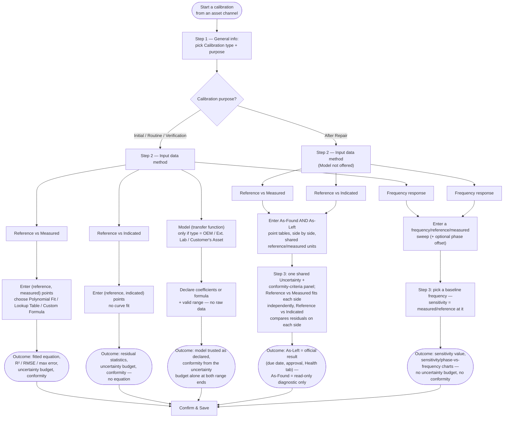

Calibration is the core of what Open Gauge does: comparing a sensor's readings against a trusted
reference, fitting a correction curve, evaluating measurement uncertainty, and issuing a
pass/fail statement — all following [JCGM 100:2008 (GUM)](../reference/standards-glossary.mdx)
and [ISO/IEC 17025:2017](../reference/standards-glossary.mdx).

## Two backend touchpoints

A calibration event involves two API calls:

1. **`POST /calibrations/analyze`** — ephemeral. Takes raw (reference, measured) point pairs
   plus fitting/uncertainty parameters, runs the full analysis, and returns the result.
   **Nothing is persisted.** The calibration wizard calls this on every input change
   (debounced) to give live feedback as you enter data.
2. **`POST /calibrations`** — atomic create. Takes the already-computed result (the wizard
   forwards whatever `/analyze` returned) plus metadata, and writes one `calibrations` row and
   its data-point rows in a single transaction. A certificate PDF is generated best-effort in
   the same request.

This split exists so you can freely explore different polynomial degrees, distributions, and
decision rules before committing — the expensive, persisted step only happens once, when you
save.

## The calibration wizard

Start a calibration from an asset's channel. The wizard has three steps:

1. **General info** — calibration type and purpose (below), calibration date, **Registered by**
   (a dropdown of the asset's organization members, defaulting to you), an optional
   **Checked by** reviewer, calibration interval, environmental conditions, and notes. Depending
   on the type/purpose chosen, additional fields appear — see below.
2. **Input data** — starts with a method picker: **Reference vs Measured** (the default —
   (reference, measured) point pairs against the channel's raw output signal, fitted to a curve),
   **Reference vs Indicated** (reference vs. an already-converted physical-quantity reading, no
   curve fit), **Model (transfer function)** (a lab-stated model, no raw data points at all —
   not offered when Calibration purpose is After Repair), or **Frequency response** (a sweep of
   frequency/reference/measured points for sensors that deliver a signal in the frequency domain —
   offered for any purpose, including After Repair — see
   [Frequency response](./frequency-response.mdx)). See
   [Alternative calibration data-entry modes](./coefficients-only.mdx) for the full breakdown,
   including how After Repair automatically splits Reference vs Measured/Indicated into
   as-found/as-left data. See [Curve fitting](./curve-fitting.mdx) for what Open Gauge does with
   raw data.
3. **Analysis / review** — the live-computed fit, uncertainty budget, and conformity
   statement. See [The uncertainty budget](./uncertainty-budget.mdx) and
   [Decision rules](./decision-rules.mdx).

Saving is never blocked by a failed (non-conforming) result — a failed calibration is still an
important, real record. If the result doesn't conform to the channel's spec, the save
confirmation shows an explicit warning naming the specification and decision rule, and the
save button relabels to **"Save anyway."**

### Choosing a workflow [#choosing-a-workflow]

Two choices decide everything about what the rest of the wizard looks like and what the saved
record can do: **Calibration purpose** on Step 1, and the **Input data method** on Step 2. Every
other Step 1 field (type, dates, lab, notes) only affects *who* the calibration is attributed to
and *where its certificate comes from* — it never changes the shape of Step 2 or Step 3, except
that **Calibration type** gates whether **Model (transfer function)** is offered at all (only for
OEM, External Accredited Lab, and Customer's Asset — see [Calibration type](#calibration-type)
below).

Every path converges on the same [approval workflow](#approval-workflow) and
[version numbering](#version-numbers) once you save — a failed or diagnostic-only result is saved
exactly the same way as a passing one, and every path produces a normal calibration record with a
certificate. What differs between paths is only *what could be computed*: Reference vs Indicated
and Model never produce a fitted-curve equation (there's no known transfer function to fit),
After Repair's as-found side never feeds the due date or Health tab no matter which base method it
started from, and Frequency response has no uncertainty budget or conformity check at all — its
result is a sensitivity ratio, not a pass/fail statement. See
[Alternative calibration data-entry modes](./coefficients-only.mdx) for the full field-by-field
breakdown of every branch above.

## Calibration type [#calibration-type]

The **Calibration type** describes *who performed the calibration*, and determines what the
**Calibration lab** field resolves to:

- **OEM** — performed by the sensor's manufacturer. Calibration lab is a read-only snapshot of
  the asset's manufacturer at the time of saving (not user-editable). A **Calibration
  certificate** upload is available (PDF only).
- **External Accredited Lab** — performed by an outside, accredited lab. Calibration lab is a
  dropdown of your [external organizations](../organizations/index.mdx#internal-vs-external-organizations)
  marked as providers. A **Calibration certificate** upload is available (PDF only).
- **Internal Lab (In-house)** — performed by your own organization, against one of your own
  assets flagged as a [reference standard](../sensors/adding-a-sensor.mdx#calibration-role).
  Calibration lab is a dropdown of your organization's locations marked as calibration labs. When
  you pick a reference asset, Open Gauge automatically fetches that asset's own most recent
  calibration's expanded uncertainty and folds it into this calibration's uncertainty budget as a
  `reference_standard` contribution — see
  [The uncertainty budget](./uncertainty-budget.mdx#contributions). No certificate upload — the
  system-generated certificate is the only one, since it's your own measurement.
- **Customer's Asset** — the asset belongs to a customer, calibrated on their behalf. Calibration
  lab is a dropdown of your external organizations marked as customers. No certificate upload.

For OEM, External Accredited Lab, and Customer's Asset, raw data entry can be skipped entirely by
choosing the **Model (transfer function)** input method on Step 2 when the certificate states the
calibration model directly — see
[Alternative calibration data-entry modes](./coefficients-only.mdx).

### Uploaded certificates

When a PDF certificate is uploaded (OEM / External Accredited Lab only), Open Gauge validates
that it's actually a PDF (content type and file signature) before accepting it. Once uploaded, it
**takes priority** over the system-generated certificate everywhere a calibration's certificate is
downloaded — the system-generated one is still produced and stored, but the uploaded one is served
instead as long as it exists. The uploaded certificate also appears in the asset's **Files** tab,
tagged with a "Calibration Certificate" badge; it can be downloaded from there but not deleted —
the only way to retire it is to void the calibration itself, consistent with calibration history
never being edited in place.

## Calibration purpose

The **Calibration purpose** records *why* the calibration was performed:

- **Initial** — the asset/channel's first calibration. Selected by default when no prior
  calibration exists for the channel; you can change it if needed.
- **Routine** — a periodic recalibration. The default once at least one prior calibration exists.
- **After Repair** — following a repair. Reveals a **Repair date** (date picker) and **Repair
  description** (up to 500 characters). Also automatically splits Step 2's Reference vs
  Measured/Indicated input into separate as-found/as-left data — see
  [Alternative calibration data-entry modes](./coefficients-only.mdx#after-repair-as-foundas-left-data).
  See below for how this affects the Health tab.
- **Verification** — a calibration performed to verify continued conformity, without necessarily
  resetting the interval clock the way a routine recalibration would.

### Before/after-repair drift comparison

Recording an **After Repair** calibration with a repair date marks a boundary in the channel's
calibration history. The Health tab gains a period dropdown — **"Before Repair `{date}`"** for each
recorded repair, plus **"Currently"** (the period since the most recent repair, selected by
default) — letting you compare drift, stability, and prediction metrics across repair events
instead of always looking at the full unbroken history, which would otherwise mix pre- and
post-repair behavior into a single misleading trend.

## Where results end up

Historical calibrations are viewable from the asset's detail page — every past calibration for
every channel, most recent first, each with its full analysis, uncertainty budget, and
certificate. Nothing is ever edited in place; a re-calibration is a new row, not a correction
to an old one.

## Version numbers

Each calibration's **version** (`v1`, `v2`, …) is an always-increasing, unique counter per
asset (or asset channel) — the next integer, starting from 1, assigned when the record is
saved. It is **not** based on `calibration_date`: backfilling a calibration you forgot to enter
earlier still gets the next available number, not a number reflecting where it falls
chronologically. A version, once assigned, is permanent — it's never reused (not even a voided
one, below) and never renumbered.

## Approval workflow

Every calibration has a **status**: **valid** (used for the channel's calibration, due-date
calculations, and drift analysis), **pending approval**, **rejected**, or **void**. Only a
**valid** calibration is used — the other three are all excluded from due-date/status
calculations and Health tab drift analysis, the same way a voided one always has been.

Naming a **Checked by** reviewer on Step 1 puts the new calibration into **pending approval**
instead of valid. The checker gets a notification (in-app, and by email if configured) and, from
the same row in the Calibration tab, can:

- **Approve** it — the calibration becomes **valid**, and the person who registered it is
  notified.
- **Reject** it, with an optional reason — the calibration becomes **rejected**, and the
  registrant is notified. A rejected calibration is terminal: correcting it means registering a
  new calibration, not editing the old one, consistent with calibration history never being
  changed in place.

Only the assigned checker, or an `admin`/`superadmin` as an override, can approve or reject a
given calibration. Leaving **Checked by** unset skips the workflow entirely — the calibration is
created as **valid** immediately, exactly as before this feature existed.

The **Show Valid Calibrations** toggle in the Calibration tab (any role except Viewer) controls
whether pending-approval, rejected, and voided calibrations are shown at all — off by default, so
the history stays focused on what's actually in effect.

## Voiding a calibration

Calibration history is never destroyed — there is no delete button, only **void**, restricted to
`admin`/`superadmin`. Void is reachable from any status (valid, pending approval, or rejected) as
an always-available override. Voiding an entry (from the trash icon on its row in the Calibration
tab):

- Marks it invalid and, optionally, records why.
- Hides it from the calibration history list and asset overview by default (an admin can turn on
  **Show Valid Calibrations** to see it again, alongside any pending or rejected entries).
- Excludes it from due-date/status calculations, so an invalid entry can't make an asset look
  calibrated when it isn't.
- Excludes it from Health tab drift/stability analysis and the curve-comparison dropdown.

The record, its data points, and its certificate are all preserved untouched — voiding only flips
a flag. An admin can **restore** a voided calibration at any time from the same row, which always
returns it to **valid** (it does not attempt to restore a previously-rejected calibration back to
"rejected" or "pending approval"). See [Calibrations](/docs/api/calibrations) in the API
Reference for the exact `DELETE /calibrations/{id}`, `POST /calibrations/{id}/restore`,
`POST /calibrations/{id}/approve`, and `POST /calibrations/{id}/reject` payloads.

A full asset export (the Export action on the asset page) always includes voided calibrations —
it's a complete historical backup, not a filtered view.
